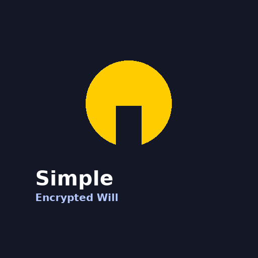
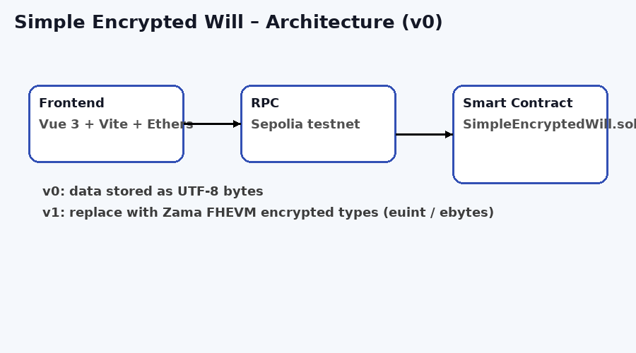
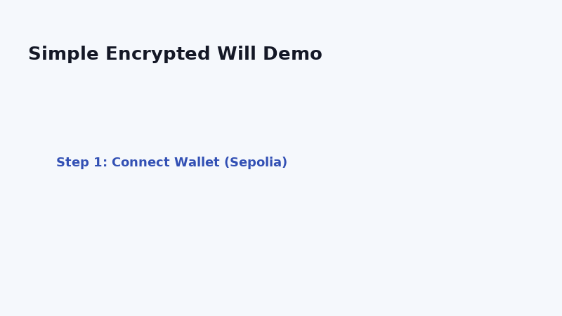

# 🔐 Simple Encrypted Will (Sepolia Demo)

🔐 Built my first encrypted will DApp using Zama FHE.
Your legacy stays private until the right moment.
Live demo 👉 https://encrypted-will-yizo.vercel.app/

A minimal prototype demonstrating how an on-chain **encrypted will** system can work on Ethereum.  
This **v0 version is non-FHE**, but the architecture is designed so the project can be upgraded to **Zama FHEVM (v1)** later.

This repository contains both:

- `encrypted-will-fhe` — Solidity smart contract (Hardhat)
- `encrypted-will-frontend` — Vue 3 + Vite frontend

## 🌟 Features (v0)

- Store will data on-chain as UTF-8 encoded bytes
- Beneficiary address registered on-chain
- Unlock mechanism simulates "condition met"
- Frontend UI for creating, unlocking, and revealing will content
- Easy upgrade path to Zama FHEVM (v1)

## 🏛 Project Structure

encrypted-will/
│
├── encrypted-will-fhe/
│   ├── contracts/
│   │   └── SimpleEncryptedWill.sol
│   ├── scripts/
│   │   └── deployEncryptedWill.ts
│   ├── hardhat.config.ts
│   └── artifacts/
│
└── encrypted-will-frontend/
    ├── src/
    │   ├── components/EncryptedWillView.vue
    │   └── contracts/SimpleEncryptedWill.json
    ├── package.json
    └── vite.config.js

## 🔧 Smart Contract

- **Network:** Ethereum Sepolia
- **Contract:** SimpleEncryptedWill
- **Address:** 0x7C5c5170bB940AECb47A651d7FC954D5fCE398cD

## 🚀 Deploy

cd encrypted-will-fhe
npm install

npx hardhat compile
npx hardhat run scripts/deployEncryptedWill.ts --network sepolia

## 💻 Frontend

cd encrypted-will-frontend
npm install
npm run dev

Open http://localhost:5173

## 🧪 Usage

1. Connect Wallet
2. Create Encrypted Will
3. Unlock Will
4. Get Will Content

## 🔮 Roadmap (v1 - Real FHE)

- Replace bytes with encrypted types (euint32, ebytes64)
- Use Zama Relayer SDK
- Perform homomorphic checks
- Deploy on Stable chain / FHEVM gateway

## 📄 License

MIT

